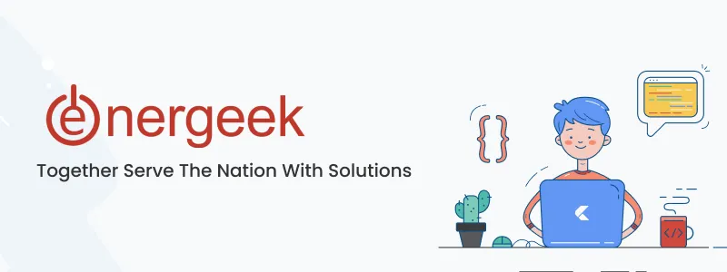

<a name="readme-top"></a>

<!--
!!! IMPORTANT !!!
This README is an example of how you could professionally present your codebase. 
Writing documentation is a crucial part of your work as a professional software developer and cannot be ignored. 

You should modify this file to match your project and remove sections that don't apply.

REQUIRED SECTIONS:
- Table of Contents
- About the Project
  - Built With
  - Live Demo
- Getting Started
- Authors
- Future Features
- Contributing
- Show your support
- Acknowledgements
- License

OPTIONAL SECTIONS:
- FAQ

After you're finished please remove all the comments and instructions!

For more information on the importance of a professional README for your repositories: https://github.com/microverseinc/curriculum-transversal-skills/blob/main/documentation/articles/readme_best_practices.md
-->


<div align="center">
  <!-- You are encouraged to replace this logo with your own! Otherwise you can also remove it. -->
  

  <br/>

</div>

<!-- TABLE OF CONTENTS -->

# 📗 Table of Contents

- [📖 About the Project](#about-project)
  - [🛠 Built With](#built-with)
    - [Tech Stack](#tech-stack)
    - [Key Features](#key-features)
  - [🚀 Live Demo](#live-demo)
- [💻 Getting Started](#getting-started)
  - [Setup](#setup)
  - [Install](#install)
  - [Deployment](#deployment)
- [👥 Authors](#authors)

<!-- PROJECT DESCRIPTION -->

# 📖 [Tes Junior Fullstack Web Developer] <a name="about-project"></a>

> Repositori untuk pengumpulan hasil test junior fullstack web developer

## 🛠 Built With <a name="built-with"></a>

### Tech Stack <a name="tech-stack"></a>

> Hasil Tes Junior Fullstack Web Developer pada PT Energeek

<details>
  <summary>Framework</summary>
  <ul>
    <li><a href="#">Laravel</a></li>
  </ul>
</details>

<details>
  <summary>Dokumentasi API</summary>
  <ul>
    <li><a href="#">Postman</a></li>
  </ul>
</details>

<details>
<summary>Database</summary>
  <ul>
    <li><a href="#">MySQL</a></li>
  </ul>
</details>

<!-- Features -->

### Key Features <a name="key-features"></a>

> Describe between 1-3 key features of the application.

- **[Desain Database yang sesuai ERD]**
  
- **[Dokumentasi API POSTMAN]**
- **[Laravel Migration dan Seeder Skill dan Jabatan]**
- **[Saving data menggunakan Ajax]**
- **[Frontend dengan Bootstrap 5, select2, niceform]**

<p align="right">(<a href="#readme-top">back to top</a>)</p>

<!-- LIVE DEMO -->

## 🚀 Demo Test <a name="live-demo"></a>

> Add a demo to your deployed project.

[screen-capture.webm](https://github.com/Akanerd/Energeek/assets/85096618/5f88e7e1-9153-4a29-9cab-67d1639da744)

<p align="right">(<a href="#readme-top">back to top</a>)</p>

<!-- GETTING STARTED -->

## 💻 Getting Started <a name="getting-started"></a>

> Describe how a to could make use of your project.

To get a local copy up and running, follow these steps.


### Setup

Clone this repository to your desired folder:


commands:

```sh
  git clone https://github.com/Akanerd/Energeek.git
```


### Install

Install this project with:

command:

```
 composer install
 cp .env.example .env
 php artisan key:generate
 php artisan migrate
```

### Deployment

You can deploy this project using:


Example:

```sh
  php artisan serve
  localhost:8000
```


<p align="right">(<a href="#readme-top">back to top</a>)</p>

<!-- AUTHORS -->

## 👥 Authors <a name="authors"></a>

> Mention all of the collaborators of this project.

👤 **Author : Muhammad Hafizh**

- GitHub: [@githubhandle](https://github.com/Akanerd)
- LinkedIn: [LinkedIn](https://linkedin.com/in/azzasafah)


<p align="right">(<a href="#readme-top">back to top</a>)</p>
